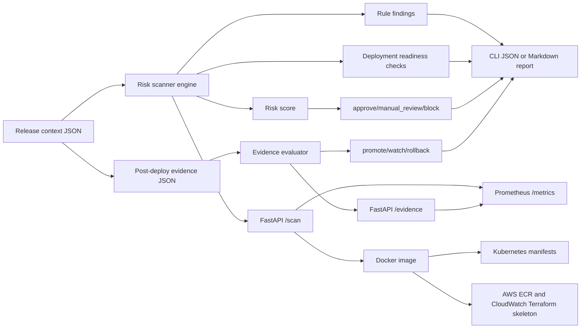

# ci-cd-release-risk-scanner

Production-shaped DevOps and platform engineering project for scoring release risk before
a deployment reaches production.

The scanner turns concrete CI/CD evidence into release decisions: pre-deploy risk from
changed files, test failures, coverage delta, dependency updates, recent incidents,
rollback history, change size, approvals, rollback plans, monitoring dashboards, and
canary posture, plus post-deploy evidence from burn rate, error rate, latency, alerts,
synthetics, and rollback events. It ships as a Python CLI and FastAPI service with
Prometheus metrics, Docker packaging, Kubernetes manifests, Terraform scaffolding, tests,
sample reports, and recruiter-readable documentation.

## Problem

Teams often deploy with incomplete context. A release can look green while still carrying
risk from migration files, dependency updates, production config changes, recent incidents,
or missing approvals. This project creates a deterministic gate that helps decide whether
to approve, require manual review, or block a release.

## Architecture



## What It Demonstrates

- CI/CD release gate design
- Deterministic risk scoring suitable for CI
- FastAPI and CLI parity through one shared scanner
- Deployment readiness scoring for rollback, monitoring, and canary evidence
- Post-deploy release evidence review with promote, watch, and rollback decisions
- Prometheus counters, gauges, and latency histogram
- Docker, Kubernetes, Terraform, and GitHub Actions template coverage
- Practical DevOps judgment around production approvals, migrations, and rollback risk

## Local Setup

```bash
make setup
```

## Run Checks

```bash
make lint
make test
```

## Generate Sample Reports

```bash
make sample
make sample-markdown
make sample-evidence
```

The risky sample exits with code `2` because it correctly blocks the release. The Makefile
treats that as expected proof of the gate.

Direct CLI usage:

```bash
PYTHONPATH=src python -m release_risk_scanner.cli tests/fixtures/risky_release.json \
  --output reports/risky-release.json
PYTHONPATH=src python -m release_risk_scanner.cli tests/fixtures/risky_release.json \
  --format markdown \
  --output reports/risky-release.md
```

The report includes a `readiness_checks` section so a reviewer can see whether rollback
plans, monitoring dashboards, and canary rollout posture are ready before deployment.

Post-deploy evidence mode:

```bash
PYTHONPATH=src python -m release_risk_scanner.cli \
  --evidence tests/fixtures/healthy_evidence.json \
  --output reports/healthy-evidence.json
PYTHONPATH=src python -m release_risk_scanner.cli \
  --evidence tests/fixtures/rollback_evidence.json \
  --format markdown \
  --output reports/rollback-evidence.md \
  --fail-on rollback
```

The healthy evidence sample returns `promote`; the rollback evidence sample returns
`rollback` and exits with code `2` when `--fail-on rollback` is used.

## Run The API

```bash
make run
```

Health:

```bash
curl http://localhost:8080/health
```

Scan:

```bash
curl -X POST http://localhost:8080/scan \
  -H "Content-Type: application/json" \
  --data @tests/fixtures/risky_release.json
```

Evidence review:

```bash
curl -X POST http://localhost:8080/evidence \
  -H "Content-Type: application/json" \
  --data @tests/fixtures/rollback_evidence.json
```

Metrics:

```bash
curl http://localhost:8080/metrics
```

## Docker

```bash
make docker-build
docker run --rm -p 8080:8080 ci-cd-release-risk-scanner:local
```

Docker Compose:

```bash
docker compose up --build
```

## Kubernetes

```bash
kubectl apply -k infra/k8s
kubectl rollout status deployment/release-risk-scanner
kubectl port-forward service/release-risk-scanner 8080:80
```

The manifests include probes, resource limits, Prometheus scrape annotations, and a
non-root container security context.

## Terraform

`infra/terraform` contains a small AWS deployment skeleton for ECR and CloudWatch logs.

```bash
cd infra/terraform
cp terraform.tfvars.example terraform.tfvars
terraform init
terraform plan
```

Local development does not require cloud credentials.

## CI/CD

The GitHub Actions template is stored at `docs/github-actions/ci.yml` because this local
GitHub token does not currently have `workflow` scope. After refreshing the token, copy it
to `.github/workflows/ci.yml`:

```bash
gh auth refresh -h github.com -s workflow
```

## Limitations

- The scoring engine is deterministic and intentionally explainable; it is not a live
  connection to GitHub Actions, Jenkins, Jira, PagerDuty, or Datadog.
- Terraform is a skeleton for deployability, not a full production environment.
- The sample rules should be tuned to a real organization before use in production.
